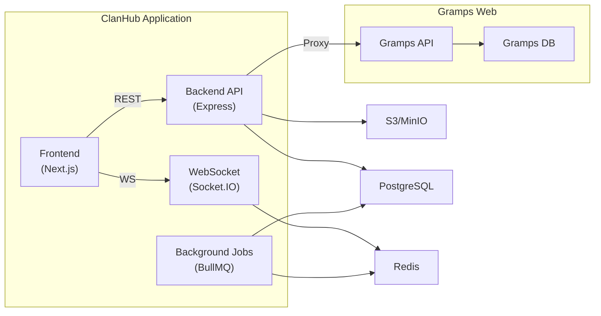

# PlanPhase2 — Kiến trúc FE & BE cho ClanHub (Giai đoạn 2: Ứng dụng Thông tin Trung tâm)

**Phiên bản:** v1.1  
**Ngày:** 2026-02-20  
**Lưu ý cập nhật:** Định hướng ứng dụng tập trung vào *Thông tin cốt lõi của dòng họ* và *Sự kiện quan trọng*. Khía cạnh *Cộng đồng/Hội nhóm* sẽ được tinh giảm thành phần phụ (Secondary).

---

## 1. Tổng quan mục tiêu Phase 2

Xây dựng ClanHub trở thành **Trung tâm Thông tin Dòng họ (Family Information Hub)**, nơi mọi thành viên hướng về để cập nhật tin tức gốc, ghi nhớ lịch sử - sự kiện và tra cứu danh bạ người thân. 

**Trọng tâm (Core):**
1. **Bảng tin Dòng họ (Family News Board):** Kênh thông báo chính thức, tin tức quan trọng từ trưởng tộc, báo cáo quỹ họ, câu chuyện truyền thống.
2. **Sự kiện & Lịch (Events & Calendar) [Rất quan trọng]:** Số hóa lịch công việc dòng họ (giỗ tổ, ngày kỵ, họp họ, thanh minh). Nhắc nhở qua email/app, quản lý đăng ký tham dự (RSVP).
3. **Danh bạ Dòng họ (Member Directory):** Sổ tay địa chỉ số, tìm kiếm người thân, tra cứu nhánh họ/chi họ để tăng tính kết nối dòng máu.

**Phần phụ (Secondary / Add-on):**
- **Cộng đồng / Nhóm con (Groups):** Các nhóm nhỏ tạo theo khu vực địa lý (Vd: Hội đồng hương) hoặc chi họ nhỏ. Đóng vai trò bổ trợ không gian giao lưu riêng, không làm loãng thông tin chung của dòng họ.

---

## 2. Kiến trúc tổng quan (mở rộng)

Luồng dữ liệu nay tối ưu hóa để ưu tiên lan truyền thông báo chung và các sự kiện hệ trọng tới toàn bộ người dùng.



### Thành phần mới

| Thành phần | Lý do |
|---|---|
| **Redis** | Cache thông báo dòng họ, dữ liệu lịch gia tộc, pub/sub |
| **BullMQ** | Xử lý hàng đợi email, nhắc nhở lịch giỗ chạp/hành lễ trọng điểm |
| **Socket.IO** | Thông báo real-time khi có tin tức/sự kiện gấp |

---

## 3. Database Schema mở rộng

### 3.1 Cập nhật Role & User model

```prisma
enum Role {
  ADMIN
  EDITOR
  ARCHIVIST
  MODERATOR    // Quản lý nội dung đăng trên bảng tin chung
  MEMBER
  GUEST
}

model User {
  // ... Phase 1 fields giữ nguyên ...
  // 🆕 Phase 2
  bio             String?
  location        String?
  branchName      String?
  grampsPersonId  String?
  posts           Post[]
  comments        Comment[]
  createdEvents   Event[]
  rsvps           RSVP[]
  notifications   Notification[]
  groupMembers    GroupMember[] // Phụ: Bảng theo dõi việc tham gia nhóm nhỏ
}
```

### 3.2 Lịch & Sự kiện Dòng họ (Trọng tâm)

```prisma
model Event {
  id          String   @id @default(cuid())
  title       String
  description String?
  startAt     DateTime
  endAt       DateTime?
  location    String?
  type        String   @default("MEMORIAL") // MEMORIAL (giỗ), MEETING (họp), FESTIVAL (lễ), BIRTHDAY
  createdBy   String
  creator     User     @relation(fields: [createdBy], references: [id])
  isRecurring Boolean  @default(false)
  recurrence  Json?    // Chu kỳ lặp (Vd: Âm lịch hàng năm)
  rsvps       RSVP[]
  
  // Phụ: Nếu sự kiện chỉ thuộc thẩm quyền một nhóm cụ thể
  groupId     String?
  group       Group?   @relation(fields: [groupId], references: [id])
  createdAt   DateTime @default(now())
}

model RSVP {
  id          String @id @default(cuid())
  eventId     String
  event       Event  @relation(fields: [eventId], references: [id], onDelete: Cascade)
  userId      String
  user        User   @relation(fields: [userId], references: [id])
  status      String @default("PENDING") // GOING, NOT_GOING, MAYBE
  guestsCount Int    @default(0)
  note        String?
  @@unique([eventId, userId])
}
```

### 3.3 Bảng tin & Thông báo (Trung tâm)

```prisma
model Post {
  id        String     @id @default(cuid())
  authorId  String
  author    User       @relation(fields: [authorId], references: [id])
  type      PostType   @default(ANNOUNCEMENT) // ANNOUNCEMENT (cáo phó/tin lớn), STORY, FUND
  title     String?
  body      Json       // TipTap JSON content
  bodyPlain String?    
  mediaRefs String[]
  isPinned  Boolean    @default(false)
  status    PostStatus @default(PUBLISHED)
  
  // Phụ: Bài viết thuộc một nhóm con nào đó
  groupId   String?
  group     Group?     @relation(fields: [groupId], references: [id])
  
  comments  Comment[]
  createdAt DateTime   @default(now())
  updatedAt DateTime   @updatedAt
}

model Comment {
  id        String   @id @default(cuid())
  postId    String
  post      Post     @relation(fields: [postId], references: [id], onDelete: Cascade)
  authorId  String
  author    User     @relation(fields: [authorId], references: [id])
  body      String
  parentId  String?  
  replies   Comment[] @relation("replies")
  createdAt DateTime @default(now())
}
```

### 3.4 Nhóm Cộng Đồng / Chi nhánh (Phần phụ)

```prisma
model Group {
  id          String   @id @default(cuid())
  name        String
  description String?
  type        String   @default("BRANCH") // BRANCH (chi họ), REGIONAL (hội đồng hương)
  visibility  String   @default("OPEN")
  avatarUrl   String?
  createdBy   String
  members     GroupMember[]
  posts       Post[]
  events      Event[]
  createdAt   DateTime @default(now())
}

model GroupMember {
  id       String @id @default(cuid())
  groupId  String
  group    Group  @relation(fields: [groupId], references: [id], onDelete: Cascade)
  userId   String
  user     User   @relation(fields: [userId], references: [id])
  role     String @default("MEMBER") 
  joinedAt DateTime @default(now())
  @@unique([groupId, userId])
}
```

---

## 4. API Endpoints mới

### Sự kiện & Lịch (`/api/events`) [Trọng tâm]
| Method | Path | Mô tả | Role |
|---|---|---|---|
| GET | `/` | Lấy chi tiết lịch dòng họ (Calendar view) | Member+ |
| GET | `/upcoming` | Sự kiện sắp tới (hiển thị trang chủ) | Member+ |
| POST | `/` | Tạo lịch (giỗ, họp, sự kiện quỹ) | Admin/Mod/Elder |
| POST | `/:id/rsvp` | Báo danh, đăng ký cỗ bàn | Member+ |

### Danh bạ & Tìm kiếm (`/api/directory`) [Trọng tâm]
| Method | Path | Mô tả | Role |
|---|---|---|---|
| GET | `/members` | Danh sách thành viên trong toàn họ | Member+ |
| GET | `/search` | Tìm kiếm người thân, tra cứu chi nhánh | Member+ |
| PATCH | `/profile` | Cập nhật hồ sơ năng lực/liên hệ | Owner |

### Bảng tin Cốt lõi (`/api/posts`) [Trọng tâm]
| Method | Path | Mô tả | Role |
|---|---|---|---|
| GET | `/` | Lấy các tin tức gốc của họ | Member+ |
| POST | `/` | Đăng thông báo/cáo phó/tin quỹ | Editor/Admin |
| POST | `/:id/comments` | Bình luận/chia buồn/chúc mừng | Member+ |

### Nhóm Cộng đồng (`/api/groups`) [Phụ]
| Method | Path | Mô tả | Role |
|---|---|---|---|
| GET | `/` | Danh sách nhóm con/chi hội | Member+ |
| POST | `/` | Tạo chi hội mới | Member+ |

---

## 5. Frontend — Cấu trúc Trải nghiệm (UI/UX)

Trang chủ (Home) sẽ được cấu trúc lại hoàn toàn để làm nổi bật **Tin Tức Dòng Họ** và **Danh sách Sự kiện sắp tới**, thay vì tiếp cận giống một mạng xã hội thông thường.

### 5.1 Cấu trúc thư mục
```
frontend/src/app/(main)/
├── ... Phase 1 pages ✅ ...
├── feed/page.tsx              ← 🆕 Bảng tin dòng họ chính thức
├── events/
│   ├── page.tsx               ← 🆕 Lịch & Sự kiện gia tộc
│   └── [id]/page.tsx          
├── directory/
│   ├── page.tsx               ← 🆕 Danh bạ dòng họ
│   └── [id]/page.tsx          ← 🆕 Trang cá nhân (Profile)
├── notifications/page.tsx     ← 🆕
└── groups/                    ← 🔽 Module cộng đồng phụ
    ├── page.tsx               
    └── [id]/page.tsx          
```

### 5.2 Giao diện cốt lõi
- **Trang chủ / Bảng tin**: Chia layout thông minh. 
  - Cột trái: Thống kê quỹ họ / Liên kết nhanh gia phả. 
  - Cột giữa: Bảng tin tập trung (thông báo chính thức, bài viết được kiểm duyệt). 
  - Cột phải: Widget sự kiện sắp tới (Giỗ, Họp, Ngày kỵ).
- **Trang Sự kiện (Calendar)**: Trình bày như một Lịch vạn niên gia tộc. Làm nổi bật sự kiện âm lịch. Chức năng đăng ký tham gia (RSVP) rõ ràng để ban tổ chức chuẩn bị hậu cần, cỗ bàn.
- **Trang Danh bạ**: Giao diện giống sổ địa chỉ chuyên nghiệp (Corporate Directory). Nhấn mạnh khả năng lọc nâng cao (tìm theo ngành/nghề, nơi ở, hoặc nhánh chi họ) để tăng giá trị liên kết.

**Navigation Menu (Sắp xếp theo thứ tự ưu tiên):**
```
🏠 Trang chủ (Bảng tin chung)
📇 Danh bạ thành viên
📅 Sự kiện & Ngày kỵ (Âm lịch)
🌳 Cây Gia Phả
📁 Tư liệu & Gia phả số
👥 Nhóm / Chi nhánh (🔽 Phụ)
🔔 Thông báo
```

---

## 6. Background Jobs (BullMQ)

Tập trung tối đa vào tính năng phân phối tin tức và nhắc lịch:

| Job | Mô tả | Mức độ |
|---|---|---|
| `lunar-event-reminder` | Chuyển đổi lịch âm-dương và nhắc nhở ngày giỗ/ngày kỵ (trước 3 ngày, 1 ngày). | Cao |
| `birthday-reminder` | Nhắc sinh nhật các bậc trưởng bối trong họ. | Cao |
| `announcement-digest` | Gửi email tổng hợp các thông cáo báo chí, sự kiện quan trọng trong tháng. | Trung bình |
| `email-sender` | Queue gửi email phân phối thông báo hệ thống. | Cao |

---

## 7. Milestones Phase 2 (Cập nhật mức độ ưu tiên)

Lộ trình được triển khai theo hướng đưa những thông tin giá trị cốt lõi lên trước.

| Milestone | Nội dung | Thời gian |
|---|---|---|
| **M5** | **Trung tâm Dữ liệu:** Danh bạ (Directory) + Profile + Tìm kiếm người thân. | 2 tuần |
| **M6** | **Thông tin & Bản tin:** Bảng tin toàn họ (Posts, Comments) + Trình soạn thảo (TipTap). | 2 tuần |
| **M7** | **Lịch Gia Tộc:** Quản lý Sự kiện (Events) + RSVP + BullMQ nhắc ngày giỗ (Âm lịch). | 3 tuần |
| **M8** | **Cộng đồng phụ & Hoàn thiện:** Nhóm/Chi nhánh (Groups) + Notifications + Moderation. | 2 tuần |
| **Tổng** | | **~9 tuần** |

---

## 8. Rủi ro & Giải pháp Phase 2

| Rủi ro | Giải pháp |
|---|---|
| Tính toán Kỷ niệm/Ngày giỗ (Âm lịch) phức tạp | Ưu tiên sử dụng thư viện lịch âm chuẩn xác (JS lunar calendar), lưu trữ song song timestamp âm-dương trong cơ sở dữ liệu. |
| Người cao tuổi khó tiếp cận | Giao diện Bảng tin & Lịch cần to, rõ ràng, thiết kế đơn giản như một tờ báo. Hỗ trợ thông báo bổ sung qua Zalo/SMS trong tương lai. |
| Mất kiểm soát thông tin (Loãng tin) | Phân quyền đăng tin chặt chẽ. Chỉ Admin/Editor mới có quyền đăng tin lên Bảng tin chính. Nội dung do thành viên đăng (Member) sẽ nằm trong các Group phụ hoặc cần qua kiểm duyệt. |
