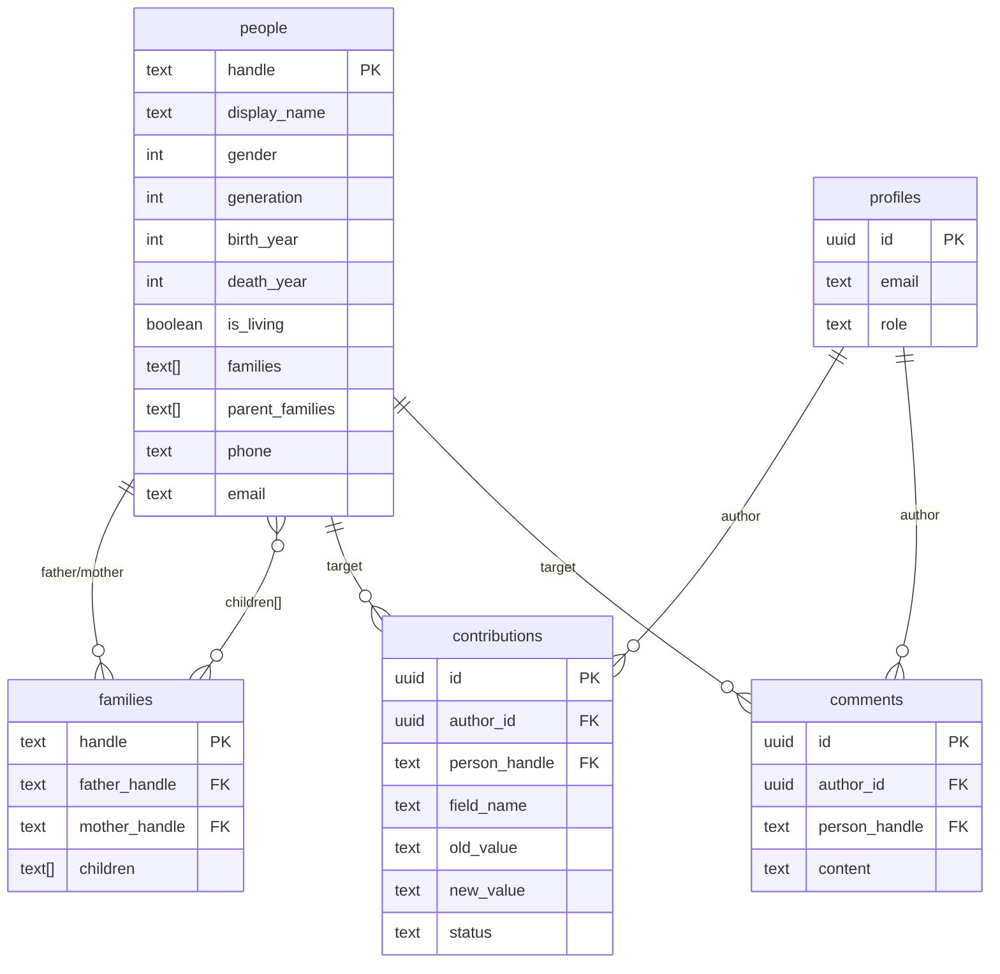

# 🌳 Gia Phả Dòng Họ Lê Huy

**Website gia phả điện tử** cho dòng họ Lê Huy — hiển thị cây gia phả toàn cảnh, quản lý thành viên, và lưu trữ thông tin dòng họ qua nhiều thế hệ.

🔗 **Live:** [giapha-lehuy.vercel.app](https://giapha-lehuy.vercel.app)

---

## 📋 Mục lục

- [Tính năng](#-tính-năng)
- [Tech Stack](#-tech-stack)
- [Cấu trúc project](#-cấu-trúc-project)
- [Cài đặt & chạy local](#-cài-đặt--chạy-local)
- [Biến môi trường](#-biến-môi-trường)
- [Database Schema](#-database-schema)
- [Deploy lên Vercel](#-deploy-lên-vercel)
- [Tái sử dụng cho dòng họ khác](#-tái-sử-dụng-cho-dòng-họ-khác)

---

## ✨ Tính năng

### 🌲 Cây Gia Phả (Interactive Tree)
- **Toàn cảnh:** Hiển thị toàn bộ cây gia phả với auto-collapse thông minh, zoom/pan tự do
- **Tổ tiên:** Xem dòng dõi từ một người lên tổ tiên
- **Hậu duệ:** Xem tất cả con cháu từ một người
- **Tìm kiếm:** Search bar tìm nhanh theo tên
- **Thu gọn/Mở rộng:** Click toggle để ẩn/hiện nhánh, hiển thị summary "📦 X người"
- **Editor Mode (Admin):** Chỉnh sửa tên, năm sinh/mất, trạng thái, đổi cha (searchable combobox), sắp xếp thứ tự con — lưu trực tiếp vào Supabase

### 📖 Sách Gia Phả
- Tự động generate nội dung sách gia phả từ dữ liệu cây
- Xuất theo thế hệ, chi tiết từng nhánh

### 📇 Danh Bạ (Directory)
- Tra cứu thông tin liên lạc thành viên (SĐT, email, Zalo, Facebook)
- Filter theo thế hệ, tìm kiếm theo tên
- Trang profile chi tiết từng người

### 📅 Sự Kiện (Events)
- Lịch sự kiện dòng họ (giỗ tổ, hội họp, lễ tết)
- Chi tiết từng sự kiện

### 📰 Bảng Tin (Feed)
- Tin tức, hoạt động dòng họ

### 🖼️ Thư Viện (Media)
- Lưu trữ hình ảnh, video dòng họ

### 👥 Thành Viên (People)
- Danh sách toàn bộ thành viên
- Profile chi tiết với thông tin cá nhân

### 🔐 Hệ thống Auth
- Đăng ký / Đăng nhập (Supabase Auth)
- Phân quyền: **Admin** (toàn quyền chỉnh sửa) vs **Viewer** (chỉ xem)
- Quên mật khẩu

### 🛡️ Admin Panel
- **Quản lý Users:** Xem danh sách user, phân quyền
- **Kiểm duyệt (Edits):** Duyệt/từ chối đóng góp từ thành viên
- **Audit Log:** Lịch sử thay đổi
- **Backup:** Sao lưu dữ liệu

### 💬 Đóng Góp & Bình Luận
- Thành viên đăng nhập có thể đề xuất chỉnh sửa thông tin
- Admin review & approve/reject
- Hệ thống comment cho từng profile

---

## 🛠 Tech Stack

| Layer | Technology |
|-------|-----------|
| **Framework** | Next.js 16 (App Router, Turbopack) |
| **Language** | TypeScript |
| **UI** | TailwindCSS 4 + shadcn/ui (Radix UI) |
| **State** | Zustand, React Query |
| **Animation** | Framer Motion |
| **Icons** | Lucide React |
| **Auth** | Supabase Auth |
| **Database** | Supabase PostgreSQL |
| **Forms** | React Hook Form + Zod validation |
| **Deploy** | Vercel |

---

## 📁 Cấu trúc project

```
GiaPhaLeHuy/
├── .env.local                    # Env vars (root — Vercel CLI)
├── README.md
└── frontend/                     # Next.js application
    ├── .env.local                # Env vars (app-level)
    ├── package.json
    ├── next.config.ts
    ├── tsconfig.json
    ├── components.json           # shadcn/ui config
    ├── public/                   # Static assets (favicon, images)
    ├── supabase/                 # 📋 SQL migration scripts
    │   ├── schema.sql            # Core: people + families tables
    │   ├── auth-schema.sql       # Auth: profiles + RLS policies
    │   ├── phase1-auth.sql       # Auth phase 1 setup
    │   ├── phase2-contributions.sql  # Contributions table
    │   ├── phase3-comments.sql   # Comments table
    │   ├── fix-trigger.sql       # Trigger fixes
    │   └── security-fix.sql      # Additional RLS policies
    └── src/
        ├── app/
        │   ├── globals.css       # Global styles + Tailwind
        │   ├── layout.tsx        # Root layout
        │   ├── (auth)/           # Auth pages (no sidebar)
        │   │   ├── login/
        │   │   ├── register/
        │   │   └── forgot-password/
        │   ├── (main)/           # Main app (with sidebar)
        │   │   ├── page.tsx      # Trang chủ (Home)
        │   │   ├── tree/         # 🌲 Cây gia phả
        │   │   │   └── tree-client.tsx  # ~1800 LOC — core tree component
        │   │   ├── book/         # 📖 Sách gia phả
        │   │   ├── directory/    # 📇 Danh bạ
        │   │   ├── events/       # 📅 Sự kiện
        │   │   ├── feed/         # 📰 Bảng tin
        │   │   ├── media/        # 🖼️ Thư viện
        │   │   ├── people/       # 👥 Thành viên
        │   │   ├── notifications/
        │   │   └── admin/        # 🛡️ Admin panel
        │   │       ├── users/
        │   │       ├── edits/
        │   │       ├── audit/
        │   │       └── backup/
        │   └── api/
        │       └── tree-overrides/ # API route for tree data overrides
        ├── components/
        │   ├── auth-provider.tsx    # Auth context + useAuth()
        │   ├── providers.tsx       # Theme + Query providers
        │   ├── contribute-dialog.tsx # Contribution form
        │   ├── comment-section.tsx  # Comment system
        │   ├── notification-bell.tsx
        │   ├── layout/
        │   │   ├── sidebar.tsx     # Main navigation sidebar
        │   │   └── header.tsx      # Top header bar
        │   └── ui/                 # shadcn/ui components
        │       ├── button.tsx
        │       ├── card.tsx
        │       ├── dialog.tsx
        │       ├── input.tsx
        │       ├── table.tsx
        │       └── ... (13 components)
        └── lib/
            ├── supabase.ts         # Supabase client init
            ├── supabase-data.ts    # CRUD operations for people/families
            ├── tree-layout.ts      # Tree layout algorithm (~680 LOC)
            ├── book-generator.ts   # Genealogy book content generator
            ├── genealogy-types.ts  # TypeScript types
            └── utils.ts            # Utility functions
```

### Core Files giải thích

| File | Vai trò |
|------|---------|
| `tree-client.tsx` | Component chính của cây gia phả — zoom/pan, collapse, editor panel, viewport culling |
| `tree-layout.ts` | Thuật toán layout cây: BFS generation assignment, anchor-based positioning, orthogonal connections |
| `supabase-data.ts` | Data layer: fetchPeople, fetchFamilies, updatePerson, moveChild, addPerson, deletePerson |
| `auth-provider.tsx` | Auth context: login/logout, role checking (admin/viewer), session persistence |
| `sidebar.tsx` | Navigation sidebar — admin section chỉ hiện cho admin users |

---

## 🚀 Cài đặt & chạy local

### Yêu cầu
- **Node.js** ≥ 18
- **npm** ≥ 9
- Tài khoản **Supabase** (free tier OK)

### Bước 1: Clone repository

```bash
git clone https://github.com/0xAstroAlpha/DongHoTree.git
cd DongHoTree/frontend
```

### Bước 2: Cài dependencies

```bash
npm install
```

### Bước 3: Cấu hình biến môi trường

```bash
cp .env.local.example .env.local
# Sửa file .env.local với thông tin Supabase của bạn
```

### Bước 4: Chạy development server

```bash
npm run dev
```

Mở [http://localhost:3000](http://localhost:3000) trong trình duyệt.

### Các script khác

```bash
npm run build    # Build production bundle
npm run start    # Start production server
npm run lint     # Run ESLint
```

---

## 🔑 Biến môi trường

Tạo file `frontend/.env.local` với nội dung:

```env
# Supabase
NEXT_PUBLIC_SUPABASE_URL=https://YOUR_PROJECT.supabase.co
NEXT_PUBLIC_SUPABASE_ANON_KEY=your_anon_key_here
SUPABASE_SERVICE_ROLE_KEY=your_service_role_key_here
```

| Biến | Mô tả | Cách lấy |
|------|--------|----------|
| `NEXT_PUBLIC_SUPABASE_URL` | Supabase project URL | Supabase Dashboard → Settings → API |
| `NEXT_PUBLIC_SUPABASE_ANON_KEY` | Anonymous key (public) | Supabase Dashboard → Settings → API |
| `SUPABASE_SERVICE_ROLE_KEY` | Service role key (SECRET) | Supabase Dashboard → Settings → API |

> ⚠️ **SUPABASE_SERVICE_ROLE_KEY** chỉ dùng server-side. KHÔNG bao giờ expose ra client.

---

## 🗄 Database Schema

Chạy các file SQL theo thứ tự trong **Supabase Dashboard → SQL Editor**:

### 1. Core Schema (`supabase/schema.sql`)
```
people       — Thông tin thành viên (handle, tên, đời, năm sinh/mất, liên lạc...)
families     — Quan hệ gia đình (cha, mẹ, danh sách con)
```

### 2. Auth Schema (`supabase/auth-schema.sql`)
```
profiles     — Profile user (role: admin/viewer)
              Auto-create trigger khi signup
              RLS policies: admin mới được write people/families
```

### 3. Contributions (`supabase/phase2-contributions.sql`)
```
contributions — Đề xuất chỉnh sửa từ thành viên
               Status: pending → approved/rejected
```

### 4. Comments (`supabase/phase3-comments.sql`)
```
comments     — Bình luận trên profile người
```

### 5. Security fixes (`supabase/security-fix.sql`)
```
Bổ sung RLS policies cho mọi bảng
```

### Thứ tự chạy:
```
schema.sql → auth-schema.sql → phase2-contributions.sql → phase3-comments.sql → security-fix.sql
```

### ERD tổng quan



---

## 🌐 Deploy lên Vercel

### Bước 1: Connect GitHub repo

1. Vào [vercel.com](https://vercel.com) → New Project
2. Import repository `0xAstroAlpha/DongHoTree`
3. **Root Directory:** `frontend`
4. **Framework:** Next.js (auto-detected)

### Bước 2: Cấu hình Environment Variables

Trong Vercel Dashboard → Settings → Environment Variables, thêm:

| Key | Value |
|-----|-------|
| `NEXT_PUBLIC_SUPABASE_URL` | `https://YOUR_PROJECT.supabase.co` |
| `NEXT_PUBLIC_SUPABASE_ANON_KEY` | `your_anon_key` |
| `SUPABASE_SERVICE_ROLE_KEY` | `your_service_role_key` |

### Bước 3: Deploy

```bash
# Auto-deploy khi push lên main
git push origin main

# Hoặc deploy thủ công
cd frontend
npx vercel --prod
```

### Custom Domain (tuỳ chọn)

1. Vercel Dashboard → Settings → Domains
2. Thêm domain của bạn
3. Cập nhật DNS records theo hướng dẫn Vercel

---

## 🔄 Tái sử dụng cho dòng họ khác

Để sử dụng project này cho một dòng họ khác, thực hiện các bước sau:

### 1. Fork & Clone

```bash
git clone https://github.com/YOUR_USERNAME/DongHoTree.git
cd DongHoTree/frontend
npm install
```

### 2. Tạo Supabase project mới

1. Vào [supabase.com](https://supabase.com) → New Project
2. Chạy các file SQL theo thứ tự ở mục [Database Schema](#-database-schema)
3. Sửa admin email trong `supabase/auth-schema.sql` (dòng 23):
   ```sql
   CASE WHEN NEW.email = 'your-admin@email.com' THEN 'admin' ELSE 'viewer' END
   ```

### 3. Cập nhật branding

| File | Thay đổi |
|------|----------|
| `src/app/(main)/page.tsx` | Tên dòng họ, mô tả trang chủ |
| `src/components/layout/sidebar.tsx` | Logo, tên hiển thị sidebar |
| `src/components/layout/header.tsx` | Tiêu đề header |
| `src/app/layout.tsx` | SEO title, meta description |
| `public/favicon.ico` | Favicon |

### 4. Nhập dữ liệu gia phả

Dữ liệu được lưu trong 2 bảng Supabase:

**Bảng `people`** — mỗi hàng là 1 thành viên:
```sql
INSERT INTO people (handle, display_name, gender, generation, is_living, families, parent_families)
VALUES ('P001', 'Nguyễn Văn A', 1, 1, false, '{"F001"}', '{}');
```

**Bảng `families`** — mỗi hàng là 1 gia đình:
```sql
INSERT INTO families (handle, father_handle, children)
VALUES ('F001', 'P001', '{"P002","P003","P004"}');
```

**Quy tắc:**
- `handle`: ID duy nhất (VD: P001, F001)
- `gender`: 1 = Nam, 2 = Nữ
- `generation`: Số thế hệ (1 = tổ tiên xa nhất)
- `families[]`: Danh sách family handle mà người đó là cha/mẹ
- `parent_families[]`: Danh sách family handle mà người đó là con
- `is_patrilineal`: `true` = chính tộc, `false` = ngoại tộc

### 5. Deploy

Làm theo hướng dẫn [Deploy lên Vercel](#-deploy-lên-vercel).

---

## 📝 License

Private project — Dòng họ Lê Huy.

---

## 🤝 Đóng góp

Thành viên dòng họ có thể đóng góp bằng cách:
1. **Đăng ký tài khoản** trên website
2. **Đề xuất chỉnh sửa** thông tin qua nút "Đóng góp" trên trang profile
3. Admin sẽ review và phê duyệt

Developers có thể fork repo và submit Pull Request.
