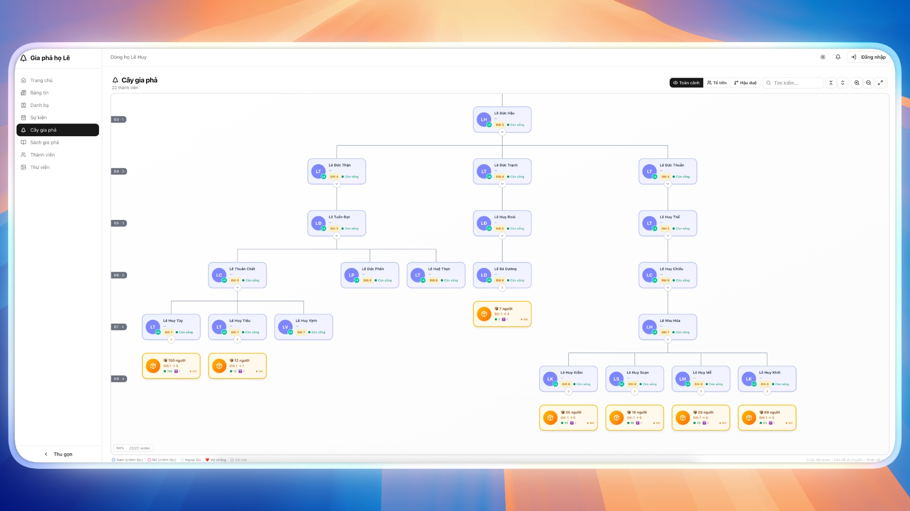
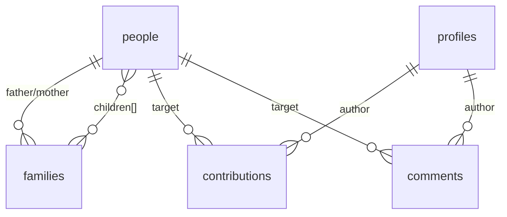

# 🌳 Gia Phả Điện Tử

**Website gia phả điện tử** — hiển thị cây gia phả toàn cảnh, quản lý thành viên, và lưu trữ thông tin dòng họ qua nhiều thế hệ. **Miễn phí hoàn toàn** (Supabase free tier + Vercel free tier).

🔗 **Demo:** [gia-pha-demo.vercel.app/tree](https://gia-pha-demo.vercel.app/tree)



---

## 📋 Mục lục

- [Tính năng](#-tính-năng)
- [Tech Stack](#-tech-stack)
- [Cấu trúc project](#-cấu-trúc-project)
- [Cài đặt & chạy local](#-cài-đặt--chạy-local)
- [Biến môi trường](#-biến-môi-trường)
- [Database Setup](#-database-setup)
- [Deploy lên Vercel](#-deploy-lên-vercel)
- [Tái sử dụng cho dòng họ khác](#-tái-sử-dụng-cho-dòng-họ-khác)

---

## ✨ Tính năng

### 🌲 Cây Gia Phả (Interactive Tree)
- **Toàn cảnh:** Hiển thị toàn bộ cây gia phả với auto-collapse thông minh, zoom/pan tự do
- **Tổ tiên:** Xem dòng dõi từ một người lên tổ tiên
- **Hậu duệ:** Xem tất cả con cháu từ một người
- **Tìm kiếm:** Search bar tìm nhanh theo tên
- **Thu gọn/Mở rộng:** Click toggle để ẩn/hiện nhánh, hiển thị summary "📦 X người"
- **Editor Mode (Admin):** Chỉnh sửa tên, năm sinh/mất, trạng thái, đổi cha (searchable combobox), sắp xếp thứ tự con

### 📖 Sách Gia Phả
- Tự động generate nội dung sách gia phả từ dữ liệu cây
- Xuất theo thế hệ, chi tiết từng nhánh

### 📇 Danh Bạ (Directory)
- Tra cứu thông tin liên lạc thành viên (SĐT, email, Zalo, Facebook)
- Filter theo thế hệ, tìm kiếm theo tên

### 📅 Sự Kiện · 📰 Bảng Tin · 🖼️ Thư Viện
- Lịch sự kiện, tin tức, hình ảnh dòng họ

### 🔐 Auth & 🛡️ Admin Panel
- Đăng ký / Đăng nhập (Supabase Auth)
- Phân quyền: **Admin** (toàn quyền) vs **Viewer** (chỉ xem)
- Quản lý users, kiểm duyệt đóng góp, audit log, backup

### 💬 Đóng Góp & Bình Luận
- Thành viên đề xuất chỉnh sửa → Admin review & approve/reject
- Hệ thống comment cho từng profile

---

## 🛠 Tech Stack

| Layer | Technology |
|-------|-----------|
| **Framework** | Next.js 16 (App Router, Turbopack) |
| **Language** | TypeScript |
| **UI** | TailwindCSS 4 + shadcn/ui (Radix UI) |
| **State** | Zustand, React Query |
| **Animation** | Framer Motion |
| **Auth & DB** | Supabase (PostgreSQL + Auth) |
| **Forms** | React Hook Form + Zod |
| **Deploy** | Vercel |

---

## 📁 Cấu trúc project

```
Gia-Pha-Dien-Tu/
├── README.md
└── frontend/
    ├── .env.local.example        # ← Copy thành .env.local
    ├── package.json
    ├── supabase/
    │   └── database-setup.sql    # Toàn bộ schema + dữ liệu mẫu
    └── src/
        ├── app/
        │   ├── (auth)/           # Login, Register, Forgot Password
        │   ├── (main)/           # App chính (sidebar)
        │   │   ├── tree/         # 🌲 Cây gia phả
        │   │   ├── book/         # 📖 Sách gia phả
        │   │   ├── directory/    # 📇 Danh bạ
        │   │   ├── events/       # 📅 Sự kiện
        │   │   ├── feed/         # 📰 Bảng tin
        │   │   ├── media/        # 🖼️ Thư viện
        │   │   ├── people/       # 👥 Thành viên
        │   │   └── admin/        # 🛡️ Admin panel
        │   └── api/
        ├── components/
        │   ├── auth-provider.tsx  # Auth context
        │   ├── layout/           # Sidebar + Header
        │   └── ui/               # shadcn/ui (13 components)
        └── lib/
            ├── supabase.ts       # Supabase client
            ├── supabase-data.ts  # CRUD operations
            ├── tree-layout.ts    # Thuật toán layout cây
            └── book-generator.ts # Tạo nội dung sách
```

### Core Files

| File | Vai trò |
|------|---------|
| `tree-client.tsx` | Component chính — zoom/pan, collapse, editor panel |
| `tree-layout.ts` | Thuật toán: BFS generation, anchor positioning, orthogonal connections |
| `supabase-data.ts` | Data layer: fetch, update, add, delete people/families |
| `auth-provider.tsx` | Auth: login/logout, role checking, session |

---

## 🚀 Cài đặt & chạy local

### Yêu cầu
- **Node.js** ≥ 18
- Tài khoản **Supabase** (free tier OK)

### Setup

```bash
# 1. Clone
git clone https://github.com/0xAstroAlpha/Gia-Pha-Dien-Tu.git
cd Gia-Pha-Dien-Tu/frontend

# 2. Install
npm install

# 3. Config
cp .env.local.example .env.local
# Sửa .env.local với Supabase keys của bạn

# 4. Run
npm run dev
```

Mở [http://localhost:3000](http://localhost:3000)

---

## 🔑 Biến môi trường

Copy `frontend/.env.local.example` → `frontend/.env.local`:

| Biến | Mô tả | Lấy từ |
|------|--------|--------|
| `NEXT_PUBLIC_SUPABASE_URL` | Project URL | Supabase → Settings → API |
| `NEXT_PUBLIC_SUPABASE_ANON_KEY` | Anonymous key (public) | Supabase → Settings → API |
| `SUPABASE_SERVICE_ROLE_KEY` | Service role key (⚠️ SECRET) | Supabase → Settings → API |

---

## 🗄 Database Setup

Chỉ cần chạy **1 file duy nhất** trong **Supabase Dashboard → SQL Editor**:

```
frontend/supabase/database-setup.sql
```

File này tạo tất cả:

| Bảng | Mô tả |
|------|-------|
| `people` | Thông tin thành viên (tên, đời, năm sinh/mất, liên lạc...) |
| `families` | Quan hệ gia đình (cha, mẹ, danh sách con) |
| `profiles` | User profiles (role: admin/viewer) + auto-create trigger |
| `contributions` | Đề xuất chỉnh sửa (pending → approved/rejected) |
| `comments` | Bình luận trên profile |

Kèm theo **dữ liệu mẫu demo** (15 thành viên, 4 thế hệ) để test ngay.

> ⚠️ Nhớ đổi email admin trong `database-setup.sql` (tìm `your-admin@example.com`).

### ERD



---

## 🌐 Deploy lên Vercel

1. [vercel.com](https://vercel.com) → New Project → Import repo
2. **Root Directory:** `frontend`
3. Thêm 3 Environment Variables (giống `.env.local`)
4. Deploy! Auto-deploy mỗi khi push lên `main`

---

## 🔄 Tái sử dụng cho dòng họ khác

### 1. Fork & Clone → npm install
### 2. Tạo Supabase project → chạy `database-setup.sql`
### 3. Đổi email admin trong SQL
### 4. Cập nhật branding:

| File | Thay đổi |
|------|----------|
| `src/app/(main)/page.tsx` | Tên dòng họ |
| `src/components/layout/sidebar.tsx` | Logo, tên sidebar |
| `src/app/layout.tsx` | SEO title |

### 5. Nhập dữ liệu gia phả

```sql
-- Thêm người
INSERT INTO people (handle, display_name, gender, generation, families, parent_families)
VALUES ('P001', 'Nguyễn Văn A', 1, 1, '{"F001"}', '{}');

-- Thêm gia đình
INSERT INTO families (handle, father_handle, children)
VALUES ('F001', 'P001', '{"P002","P003"}');
```

**Quy tắc:** `gender`: 1=Nam, 2=Nữ · `generation`: 1=tổ tiên xa nhất · `is_patrilineal`: true=chính tộc

### 6. Deploy lên Vercel → Done! 🎉

---

## 📝 License

MIT — Free to use for any family.

## 🤝 Đóng góp

Fork repo, submit Pull Request, hoặc mở Issue.
