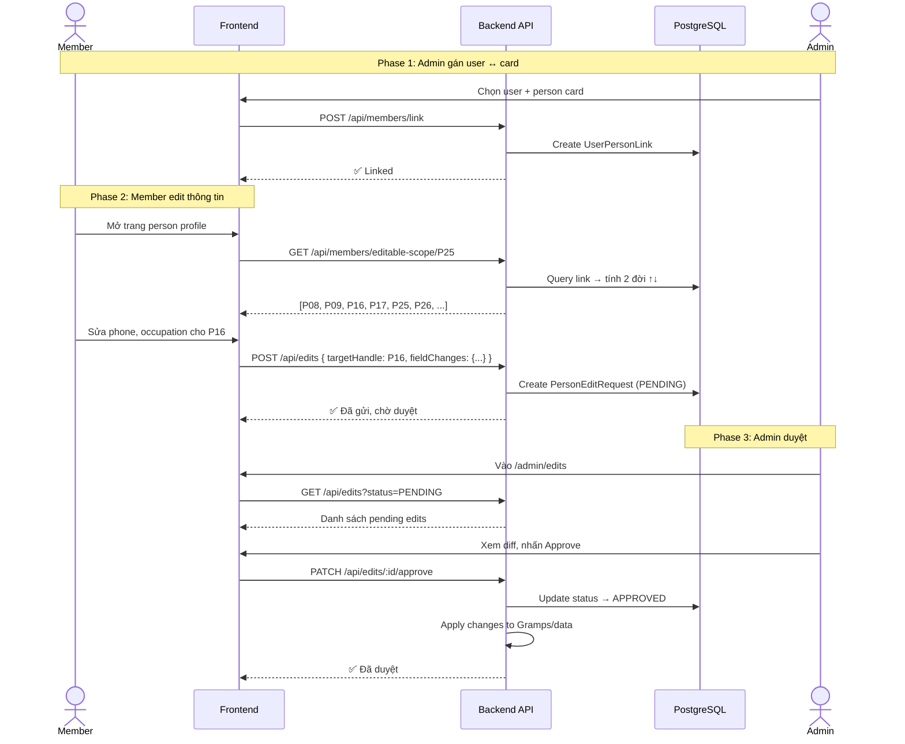

# Story 6.1: Quản lý thành viên, phân quyền cập nhật & kiểm duyệt

## User Story

As a **family member** linked to a person card,
I want to edit information for myself and 2 generations up/down,
So that I can contribute family data while ensuring accuracy through admin review.

As an **admin**,
I want to review and approve/reject member edits before they go live,
So that all published genealogy data is verified and accurate.

### Quy tắc phân quyền đã duyệt:

| Role | Edit Scope | Approval |
|------|-----------|----------|
| **Admin** | Toàn bộ | Không cần |
| **Editor** | Toàn bộ | **Bypass** — auto-approved |
| **Archivist** | Toàn bộ | **Bypass** — auto-approved |
| **Member** | 2 đời ↑ + bản thân + 2 đời ↓ | **Cần admin duyệt** |
| **Guest** | Không | Không |

| Action | Member | Editor/Archivist | Admin |
|--------|--------|-----------------|-------|
| UPDATE_PERSON | ✅ (pending) | ✅ (auto) | ✅ |
| CREATE_PERSON | ✅ (pending) | ✅ (auto) | ✅ |
| DELETE_PERSON | ✅ (pending) | ✅ (auto) | ✅ |
| ADD_SPOUSE | ✅ (pending) | ✅ (auto) | ✅ |

## Bối Cảnh

Hiện tại chỉ có Admin/Editor mới edit được dữ liệu. Dòng họ lớn (300-500 người) cần huy động thành viên tự cập nhật thông tin bản thân + người thân gần (cha mẹ, con cháu). Tuy nhiên, data phải qua kiểm duyệt admin trước khi "live" để đảm bảo chính xác.

### Quy tắc phân quyền:

```
User gán với card P25 (Lê Huy, đời 5):
  ↑ 2 đời: đời 3 (ông bà) + đời 4 (cha mẹ)  → CÓ THỂ EDIT
  ↓ 2 đời: đời 6 (con) + đời 7 (cháu)        → CÓ THỂ EDIT
  = đời 5 (bản thân + anh chị em)              → CÓ THỂ EDIT
  
  Tất cả edits → PENDING → Admin duyệt → APPROVED/REJECTED
```

## Data Model — New Prisma Models

```prisma
// === MEMBER LINKING ===

model UserPersonLink {
  id           String   @id @default(cuid())
  userId       String
  user         User     @relation(fields: [userId], references: [id])
  personHandle String   // Gramps handle (e.g. "P25")
  linkedBy     String   // admin userId who linked
  linkedAt     DateTime @default(now())

  @@unique([userId])         // 1 user = 1 card
  @@unique([personHandle])   // 1 card = 1 user
  @@map("user_person_links")
}

// === EDIT REQUESTS (PENDING EDITS) ===

enum EditRequestStatus {
  PENDING
  APPROVED
  REJECTED
}

model PersonEditRequest {
  id              String            @id @default(cuid())
  requesterId     String
  requester       User              @relation("editRequester", fields: [requesterId], references: [id])
  targetHandle    String            // person handle being edited
  targetName      String            // snapshot of person name at time of request
  editType        String            // CREATE_PERSON | UPDATE_PERSON | ADD_CHILD | ADD_SPOUSE
  fieldChanges    Json              // { field: { old, new } }
  reason          String?           // optional note from requester
  status          EditRequestStatus @default(PENDING)
  reviewerId      String?
  reviewer        User?             @relation("editReviewer", fields: [reviewerId], references: [id])
  reviewNote      String?
  reviewedAt      DateTime?
  createdAt       DateTime          @default(now())

  @@index([requesterId])
  @@index([targetHandle])
  @@index([status])
  @@index([createdAt])
  @@map("person_edit_requests")
}
```

## API Endpoints

| Method | Endpoint | Role | Description |
|--------|----------|------|-------------|
| GET | `/api/members/link` | Member+ | Lấy link status của current user |
| POST | `/api/members/link` | Admin | Gán user ↔ person card |
| DELETE | `/api/members/link/:id` | Admin | Gỡ link |
| GET | `/api/members/editable-scope/:handle` | Member+ | Trả về danh sách handles user có quyền edit |
| POST | `/api/edits` | Member+ | Tạo edit request (pending) |
| GET | `/api/edits` | Admin | Danh sách edit requests (filter by status) |
| GET | `/api/edits/my` | Member+ | Lịch sử edit requests của mình |
| PATCH | `/api/edits/:id/approve` | Admin | Duyệt edit request |
| PATCH | `/api/edits/:id/reject` | Admin | Từ chối edit request |

## Luồng Nghiệp Vụ



## Acceptance Criteria

### AC1: Admin Link User ↔ Card
- **Given** admin vào User Management
- **When** chọn user + person card → Link
- **Then** UserPersonLink được tạo (1:1)

### AC2: Editable Scope (2 đời ↑↓)
- **Given** user linked với card P25 (đời 5)
- **When** GET editable-scope
- **Then** trả về handles thuộc đời 3, 4, 5, 6, 7 có liên kết gia đình

### AC3: Member Submit Edit
- **Given** member đã link và target nằm trong scope
- **When** submit edit request
- **Then** PersonEditRequest tạo với status=PENDING
- **And** hiển thị badge "Chờ duyệt" trên UI

### AC4: Admin Approve/Reject
- **Given** có pending edit requests
- **When** admin approve/reject
- **Then** status cập nhật, audit log ghi nhận
- **And** nếu approved → data được apply

### AC5: UI — Edit Request Queue
- **Given** admin vào `/admin/edits`
- **Then** hiển thị bảng: Người gửi, Đối tượng, Loại thay đổi, Ngày, Status, Actions

### AC6: UI — Member Edit Form
- **Given** member vào person profile trong scope
- **Then** hiển thị nút "Đề xuất chỉnh sửa"
- **When** nhấn → mở form edit với diff preview

## Frontend Pages

| Page | Type | Description |
|------|------|-------------|
| `/admin/edits` | NEW | Admin: Danh sách edit requests + approve/reject |
| `/people/[handle]` | MODIFY | Thêm nút "Đề xuất chỉnh sửa" cho linked members |
| `/admin/users` | MODIFY | Thêm cột "Linked Person" + action link/unlink |
| `/profile/edits` | NEW | Member: Lịch sử edit requests của mình |

## Tasks

- [ ] T1: Thêm Prisma models (UserPersonLink + PersonEditRequest)
- [ ] T2: Migration + seed data
- [ ] T3: API — POST/GET/DELETE `/api/members/link`
- [ ] T4: API — GET `/api/members/editable-scope/:handle` (tính 2 đời ↑↓)
- [ ] T5: API — CRUD PersonEditRequest
- [ ] T6: API — PATCH approve/reject + apply changes
- [ ] T7: Frontend — Admin Edit Queue page (`/admin/edits`)
- [ ] T8: Frontend — "Đề xuất chỉnh sửa" button + form on person profile
- [ ] T9: Frontend — Admin link user ↔ card (modify `/admin/users`)
- [ ] T10: Frontend — Member edit history page (`/profile/edits`)
- [ ] T11: Test luồng end-to-end

## Dependencies

- Epic 1 (Auth + RBAC) — ✅ done
- Epic 2 (Genealogy Core + Tree) — ✅ done
- PersonDetail extended fields — ✅ done (previous session)

## Risks

| Risk | Mitigation |
|------|-----------|
| Gramps API read-only | Store pending edits in PostgreSQL, apply via Gramps API when approved |
| Scope calculation accuracy | Unit test with 5-generation mock data |
| Concurrent edit conflicts | Last-write-wins with diff summary in audit log |
